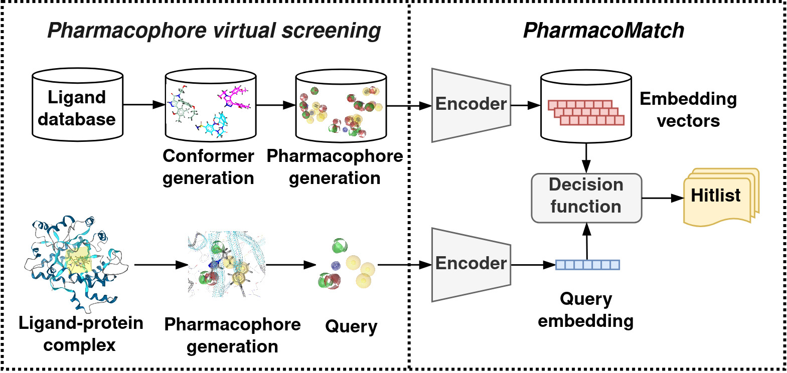

### PharmacoMatch: Efficient 3D Pharmacophore Screening via Neural Subgraph Matching



**General**

This is the official implementation of PharmacoMatch. You can find the ICLR paper on [OpenReview](https://openreview.net/forum?id=27Qk18IZum&referrer=%5BAuthor%20Console%5D(%2Fgroup%3Fid%3DICLR.cc%2F2025%2FConference%2FAuthors%23your-submissions)), the preprint version is available on [arXiv](https://arxiv.org/abs/2409.06316).
You can download the preprocessed data from the provided figshare link. 
A pretrained model is readily available for use.

This project was developed with the following system specifications:
- **GPU:** NVIDIA GeForce 3090 RTX with 24 GB GDDR6X (recommended for model inference and training).
- **CPU:** AMD EPYC 7713 64-Core Processor (used for data preprocessing and pharmacophore alignment).
- **OS:** Rocky Linux (v9.4).

Make sure to enable GPU acceleration on your machine. 

If you use this code or the models in your research, please cite our paper:

```bibtex
    @inproceedings{rose2025pharmaco_match,
        title={PharmacoMatch: Efficient 3D Pharmacophore Screening through Neural Subgraph Matching}, 
        author={Daniel Rose and Oliver Wieder and Thomas Seidel and Thierry Langer},
        booktitle={International Conference on Learning Representations (ICLR)},
        year={2025}
    }
```

**Installation**

1. **Install Conda and create a new environment:**

    ```bash
    conda create -n pharmaco_match python==3.10.12
    conda activate pharmaco_match
    ```

2. **Navigate to the `PharmacoMatch` folder and install dependencies:**

    ```bash
    pip install .
    ```

3. **Install additional PyG dependencies:**

    ```bash
    pip install torch_scatter torch_sparse torch_cluster -f https://data.pyg.org/whl/torch-2.0.1+cu117.html
    ```

4. **Download preprocessed data from figshare:**

    The data can be found [here](https://figshare.com/s/24757b89ea7f0932bf3c?file=49290172). Unzip and place the `data` folder into the root directory of the `PharmacoMatch` project.

**Repository Contents**

- **`data`:** Contains unlabeled data for model training and virtual screening datasets for model evaluation.
- **`data_preprocessing`:** 
    - `bash_scripts`: Implements the data processing pipeline with `.sh` files.
    - `python_scripts/cdpl`: Contains scripts for data processing from the [CDPKit website](https://cdpkit.org/cdpl_python_cookbook/index.html).
    - `python_scripts/utils`: Contains additional preprocessing scripts.
- **`pharmaco_match`:** Our PyTorch code for model training, structured as:
    - `dataset`: Data-related modules.
    - `model`: Model implementation and training logic.
    - `utils`: Contains utility functions. 
    - `virtual_screening`: Classes for virtual screening with our model.
- **`trained_model`:** Stores the pretrained model used in our study.
- **`scripts`**: Training, benchmarking, and experiments scripts.


**Model Evaluation**

To reproduce our results, execute the following scripts:

- **`benchmark.py`:** Embeds test datasets, generates visualizations, and calculates evaluation metrics as reported in our paper.

```bash
python3 scripts/benchmark.py 
```

- **`positional_perception.py`:** Performs the positional perception experiment. 

```bash
python3 scripts/positional_perception.py 0
```

**Model Training**

You can train the model yourself as follows:

```bash
python3 scripts/training.py 0
```

where `0` corresponds to the GPU device index. If your hardware doesn't meet the memory requirements, you can reduce the model size by decreasing the `hidden_dim_encoder` parameter in the `config.yaml` file (note that this may reduce model performance).

---

If you want to preprocess the data yourself, you can do so as follows:

**Setting Up the Chemical Data Processing Toolkit (CDPKit)**

For data processing, we use the open-source software [CDPKit](https://cdpkit.org/index.html). Follow the installation instructions provided [here](https://cdpkit.org/installation.html), installers can be found [here](https://github.com/molinfo-vienna/CDPKit/releases). The installation will include a `CDPKit/Bin` subfolder containing command-line applications.

Key tools:
- `confgen`: Generates `.sdf` files from `.smi` files for conformer generation.
- `psdcreate`: Creates pharmacophore database files (`.psd` files) from `.sdf` files.

**IMPORTANT**

Edit the path variables at the top of the bash scripts to match your CDPKit installation and PharmacoMatch root-folder:

```bash
cdpkit='<your_path>/CDPKit/Bin'
project='<your_path>/PharmacoMatch'

```

**Unlabeled Data for Model Training**

You can use the file `data/training_data/input/chembl_data.smi` and run the preprocessing script:

```bash
./data_processing/bash_scripts/training_data.sh
```

**Test Datasets Processing**

The `data/DUD-E` folder contains ten different targets from the [DUD-E](https://dude.docking.org/) benchmark dataset. 
We have included the input files and pharmacophore queries generated from the receptor structure. To run the data processing pipeline, execute:

```bash
./data_processing/bash_scripts/vs_data_generation.sh
```

The folder structure of the test sets is as follows:
- **`input`:** Contains `actives.smi` and `inactives.smi` files.
- **`preprocessing`:** Contains intermediate processing files.
- **`raw`:** Includes actives and inactives in `.psd` format and `query.pml` for interaction pharmacophore.
- **`vs`:** Stores pharmacophore alignment scores.
- **`processed`:** Contains the final PyTorch datasets.